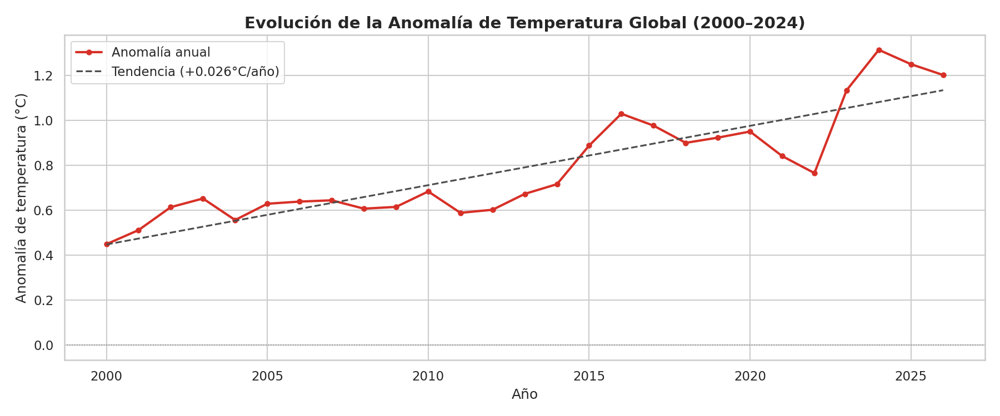
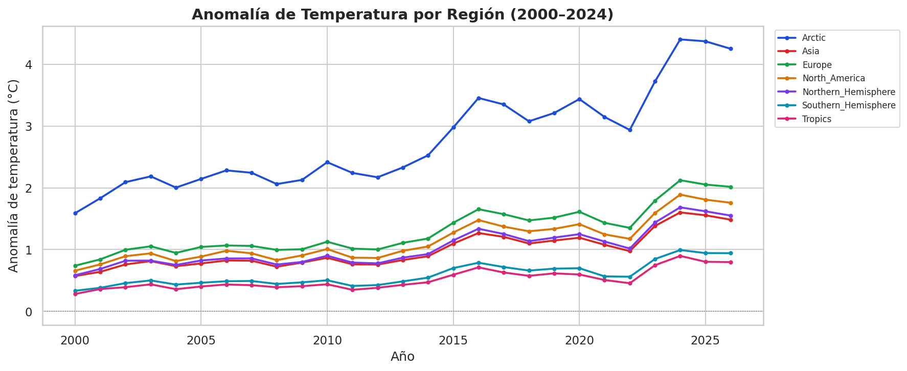
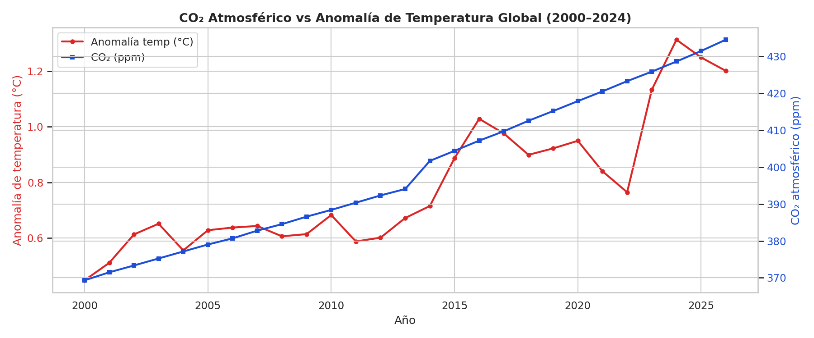
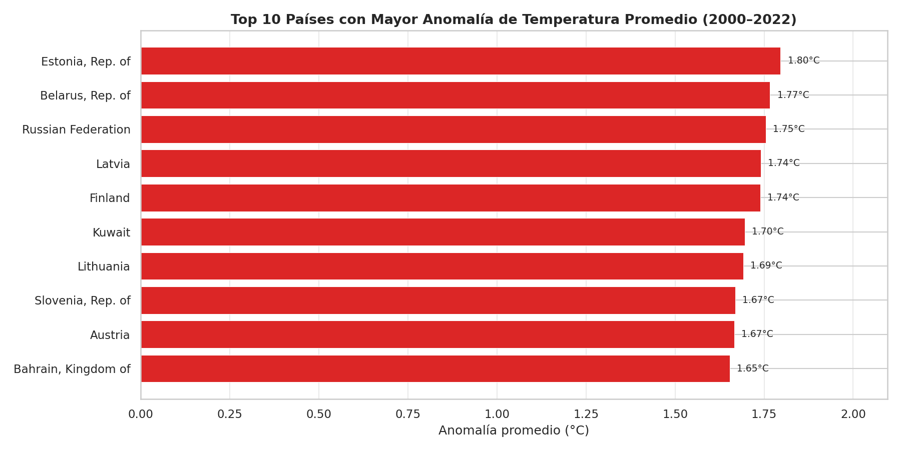
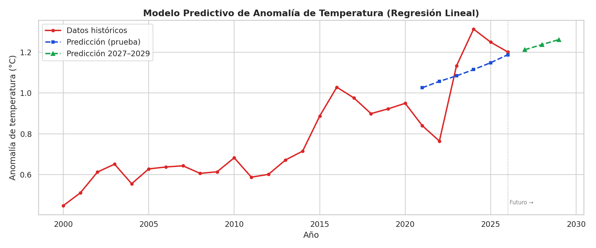
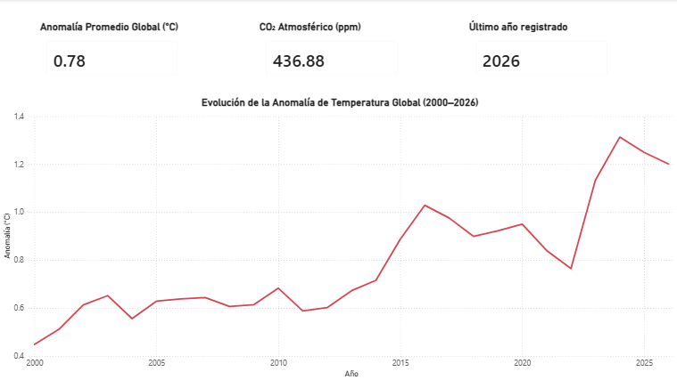
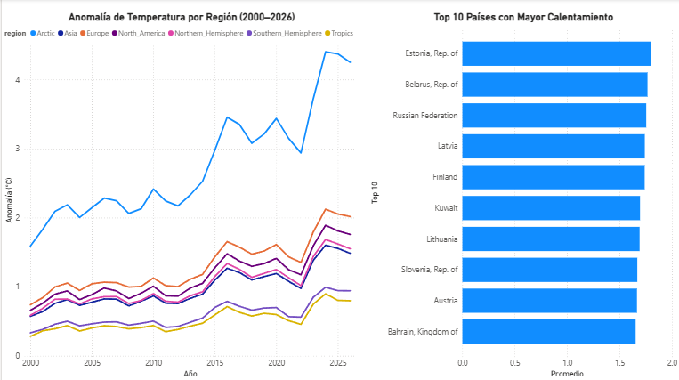
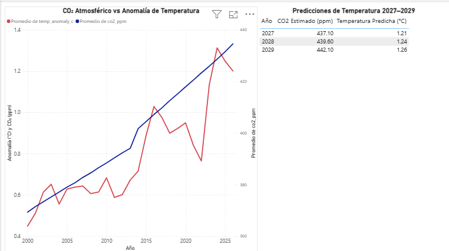

# 🌡️ Análisis de Indicadores Climáticos Globales (2000–2026)

Proyecto de análisis de datos end-to-end sobre el cambio climático global,
desarrollado como proyecto de portafolio profesional.

---

## 📌 Preguntas de negocio

1. ¿Cómo ha evolucionado la temperatura promedio global entre 2000 y 2026,
   y qué regiones muestran el calentamiento más acelerado?
2. ¿Existe una relación estadísticamente significativa entre el aumento de
   CO₂ atmosférico y el incremento de temperaturas extremas por país?
3. ¿Es posible construir un modelo que estime la temperatura promedio
   para los próximos 3 años (2027–2029)?

---

## 🔍 Hallazgos principales

| # | Hallazgo |
|---|---|
| 1 | La temperatura global aumentó **+0.026°C por año**, acumulando +0.65°C en 25 años |
| 2 | El **Ártico** es la región más afectada, superando **+4.4°C** de anomalía en 2024 |
| 3 | Correlación CO₂ vs temperatura: **r = 0.90** (p < 0.05), R² = 81.1% |
| 4 | Los 10 países con mayor calentamiento son predominantemente del norte de Europa |
| 5 | El modelo predice anomalías de **1.21°C, 1.24°C y 1.26°C** para 2027, 2028 y 2029 |

---

## 🛠️ Stack tecnológico

- **Lenguaje:** Python 3.12
- **Librerías:** Pandas, NumPy, Matplotlib, Seaborn, scikit-learn, SciPy
- **Visualización:** Power BI Desktop
- **Entorno:** Google Colab

---

## 📁 Estructura del repositorio

    climate-data-analysis/
    ├── data/
    │   └── clean/          # Datasets procesados listos para análisis
    ├── notebooks/
    │   ├── 01_limpieza_datos.ipynb
    │   ├── 02_eda_exploratorio.ipynb
    │   └── 03_modelo_predictivo.ipynb
    ├── plots/              # Gráficas generadas en el EDA
    ├── dashboard/          # Dashboard interactivo Power BI
    │   └── dashboard_clima.pbix
    └── README.md
---

## 📊 Datasets

| Dataset | Fuente | Descripción |
|---|---|---|
| Climate Change Indicators | FAO / Kaggle | Indicadores de temperatura por país desde 1961 |
| Global Climate & Energy Transition | Kaggle | Anomalías, CO₂, mix energético y eventos 2000–2026 |

---

## 👩‍💻 Autora

**Angela Murillo**  
Ingeniera de Sistemas | Analista de Datos  

---

## 📈 Visualizaciones

### Tendencia de temperatura global

### Anomalía por región

### CO₂ vs Temperatura

### Top 10 países

### Modelo predictivo

### Dashboard Power BI

